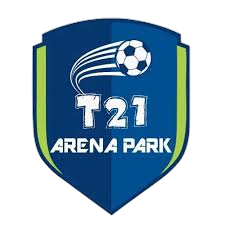

<p align="center">
  
</p>

<p align="center">
Aplicação desenvolvida para o controle de uma escola de futebol para alunos com síndrome de Down.
</p>

<p align="center">
  <a href="#-ideia">Ideia</a>&nbsp;&nbsp;&nbsp;|&nbsp;&nbsp;&nbsp;
  <a href="#-configuração-do-ambiente">Configuração do ambiente</a>&nbsp;&nbsp;&nbsp;|&nbsp;&nbsp;&nbsp;
  <a href="#-tecnologias">Tecnologias</a>
</p>


## 💡 Ideia

O projeto consiste em uma plataforma para gerenciamento de uma escola de futebol para alunos com síndrome de Down. Com ele, é possível configurar organizações, gerenciar voluntários e atletas, além de realizar avaliações de desempenho dos alunos.

## 🔧 Configuração do ambiente

1. **Clone o repositório**:

```bash
git clone https://github.com/t21-arena-park/web.git
```

2. **Instale as dependências**:

```bash
npm install
```

3. **Crie um arquivo .env.local na raiz do projeto com as seguintes variáveis**:

Para rodar o projeto localmente, é necessário criar um arquivo `.env.local` na raiz do projeto com as seguintes variáveis:

```bash
VITE_API_URL="http://localhost:3333"
VITE_ENABLE_API_DELAY="true" # Caso queira que tenha um delay nas requisições
```

Você também pode copiar e colar o que está dentro do arquivo `.env.example`.

4. **Inicie o servidor de desenvolvimento**:

```bash
npm run dev
```

## 🚀 Tecnologias

- ReactJS
- ViteJS
- TypeScript
- Axios
- TanStack Query (React Query)
- React Router DOM
- TailwindCSS